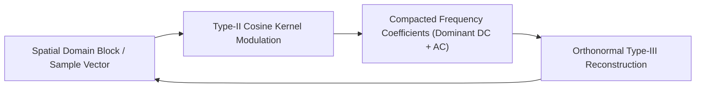

# Discrete Cosine Transform (DCT-II) Skill

Orthonormal Type-II Discrete Cosine Transform engine providing exceptional spectral energy compaction for JPEG image compression and audio codecs.

## Features
- **100% Python Standard Library**: Pure standard trigonometric formulation.
- **Orthonormal Normalization**: Preserves total signal energy (Parseval identity).
